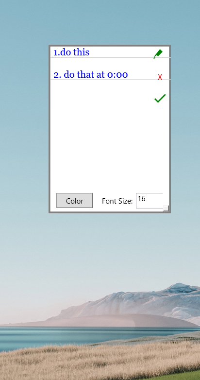

# To-Do List

A feature-rich WPF application for managing your daily tasks with customizable text formatting and intuitive controls.

## Application Modes

### Application in Edit Mode 


When the application is opened, it starts in edit mode by default, where you can type, edit, and manage tasks.

### Application in Invisible Mode


After finishing editing tasks, you can hide the controls, leaving only the task text visible.


## Table of Contents

- [About the Project](#about-the-project)
  - [Features](#features)
- [Getting Started](#getting-started)
  - [Prerequisites](#prerequisites)
  - [Installation](#installation)
    - [Option 1: Download the Installer Folder](#option-1-download-the-installer-folder)
    - [Option 2: Build from Source](#option-2-build-from-source)
- [Usage](#usage)
  - [Starting the Application](#starting-the-application)
  - [Editing Tasks](#editing-tasks)
  - [Strikethrough (Pen Mode)](#strikethrough-pen-mode)
  - [Customization](#customization)
  - [Resizing and Moving](#resizing-and-moving)
  - [Exiting the Application](#exiting-the-application)
- [Project Structure](#project-structure)
- [License](#license)
- [Contact](#contact)

## About the Project

The **To-Do List** application is designed to help you manage your tasks efficiently. It provides a simple and clean interface with rich text editing capabilities, allowing you to customize your to-do list to your liking.

### Features

- **Rich Text Editing**: Customize font size, style, and color.
- **Strikethrough Functionality**: Mark tasks as completed with a strikethrough effect.
- **Pen Mode**: Toggle strikethrough on tasks using an intuitive pen tool.
- **Resizable and Movable Window**: Adjust the window size and position to fit your workflow.
- **Customizable Interface**: Personalize your to-do list with various fonts and colors.
- **Starts in Edit Mode**: Begin editing your tasks immediately upon launching the application.

## Getting Started

To get a local copy up and running, follow these simple steps.

### Prerequisites

- **Windows Operating System**: The application is built using WPF for Windows.
- **.NET Framework 4.7.2 or later**: Ensure you have the correct .NET Framework installed. You can download it from [Microsoft's official website](https://dotnet.microsoft.com/download/dotnet-framework/net472).

### Installation

#### Option 1: Download the Installer Folder

1. **Download the Installer Folder**

   - Navigate to the [`installer/`](installer/) directory in the repository.
   - Download the entire `installer` folder.

2. **Run the Application**

   - Open the downloaded `installer` folder.
   - **Directly use the `.exe` file** by double-clicking on `TextWidgetApp.exe`.

**Note**: The `installer` folder contains the following files required to run the application:

- `TextWidgetApp.deps.json`
- `TextWidgetApp.dll`
- `TextWidgetApp.exe`
- `TextWidgetApp.pdb`
- `TextWidgetApp.runtimeconfig.json`

#### Option 2: Build from Source

1. **Clone the Repository**

   ```bash
   git clone https://github.com/HarishVasalamarry/To-Do-list.git
   ```

2. **Navigate to the Project Directory**

   ```bash
   cd To-Do-List/TextWidgetApp
   ```

3. **Open the Solution in Visual Studio**

   - Double-click on `TextWidgetApp.sln` to open the project.

4. **Restore NuGet Packages**

   - Visual Studio should automatically restore any NuGet packages.
   - If not, right-click on the solution in the Solution Explorer and select **Restore NuGet Packages**.

5. **Build the Solution**

   - Go to **Build > Build Solution** or press `Ctrl+Shift+B`.
   - Ensure the build configuration is set to **Release** for optimal performance.

6. **Run the Application**

   - Press `F5` to run the application in Debug mode, or run the compiled executable from `bin/Release/TextWidgetApp.exe`.

## Usage

### Starting the Application

- **Double-Click the Executable**: Launch the application by double-clicking `TextWidgetApp.exe` located in the `installer` folder or `bin/Release` directory.

### Editing Tasks

- **Start in Edit Mode**: The application opens in edit mode by default.
- **Add or Modify Tasks**: Click inside the text area to add or edit your tasks.
- **Save Changes**: Click the **Done** button (✔) to exit edit mode and save your changes.

### Strikethrough (Pen Mode)

- **Activate Pen Mode**: Click the **Pen** icon (🖊) to enter pen mode.
- **Mark Tasks as Completed**: Click on a task to toggle the strikethrough effect.
- **Deactivate Pen Mode**: Click the **Pen** icon again to exit pen mode.

### Customization

- **Font Size**: Adjust the font size using the **Font Size** input box.
  - Enter a numeric value to change the size.
- **Font Style**: Choose a font from the **Font Style** dropdown menu.
- **Font Color**:
  - Click the **Color** button to open the color palette.
  - Select a color to change the text color.

### Resizing and Moving

- **Resize the Window**: Click and drag the resize handle at the bottom-right corner.
- **Move the Window**: Click and drag the window border to reposition it.

### Exiting the Application

- Click the **Close** button (X) at the top-right corner to exit the application.

## Project Structure

```
To-Do List/
├── installer/
│   ├── TextWidgetApp.deps.json
│   ├── TextWidgetApp.dll
│   ├── TextWidgetApp.exe
│   ├── TextWidgetApp.pdb
│   ├── TextWidgetApp.runtimeconfig.json
├── TextWidgetApp/
│   ├── App.xaml
│   ├── App.xaml.cs
│   ├── AssemblyInfo.cs
│   ├── MainWindow.xaml
│   ├── MainWindow.xaml.cs
│   ├── TextWidgetApp.csproj
│   ├── TextWidgetApp.sln
├── .gitattributes
├── .gitignore
├── LICENSE
└── README.md
```

- **installer/**: Contains the compiled application files for users to run directly.
  - **Files included**:
    - `TextWidgetApp.deps.json`
    - `TextWidgetApp.dll`
    - `TextWidgetApp.exe`
    - `TextWidgetApp.pdb`
    - `TextWidgetApp.runtimeconfig.json`
- **TextWidgetApp/**: Contains all your application source code.
- **.gitattributes**: Git configuration file.
- **.gitignore**: Specifies files and folders for Git to ignore.
- **LICENSE**: Contains the MIT License under which your project is distributed.
- **README.md**: Provides an overview and documentation for your project.

## Contributing

Contributions are what make the open-source community such an amazing place to learn, inspire, and create. Any contributions you make are **greatly appreciated**.

1. **Fork the Project**
2. **Create your Feature Branch** (`git checkout -b feature/AmazingFeature`)
3. **Commit your Changes** (`git commit -m 'Add some AmazingFeature'`)
4. **Push to the Branch** (`git push origin feature/AmazingFeature`)
5. **Open a Pull Request**

## License

Distributed under the MIT License. See `LICENSE` for more information.

## Contact

Harish Vasalamarry - [harish.vasalamarry@gmail.com](mailto:harish.vasalamarry@gmail.com)

Project Link: [https://github.com/HarishVasalamarry/To-Do-list](https://github.com/HarishVasalamarry/To-Do-list)
